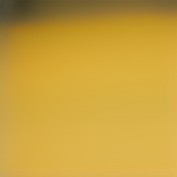
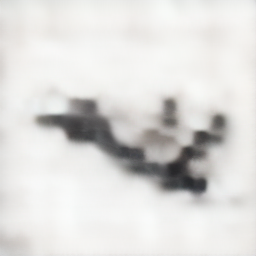
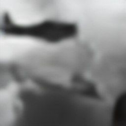
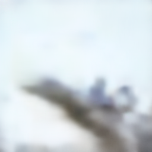
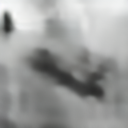

# logs

## 2025/7/22

### inference settings

GPT-B: /mnt/disk3/jinyuan/ckpts/lamma_gen/ar/pretrain_cifar10/2025-07-15-14-52-51/060-GPT-B/checkpoints/0002600.pt
GPT-Reg-B: /mnt/disk3/jinyuan/ckpts/lamma_gen/ar_reg/cifar10/2025-07-21-22-54-18/009-GPT-B/checkpoints/0009000.pt
both trained on cifar10 train dataset from scratch
9000 is the max train step without overfitting(val loss increasing over 9000 steps)

### inference results

#### GPT-B sampling results


the sampled tokens work as memory

#### GPT-Reg sampling results

with memory


without memory



only memory


## 2025/7/23

### Test on a subset with four plane pictures in cifar10

the memory is added through residual

```python
h = x + self.drop_path(self.attention(self.attention_norm(x), freqs_cis, start_pos, mask) + mem)
out = h + self.drop_path(selfeed_forward(self.ffn_no(h)))
```

train a GPT-B from scratch on subset
train a GPT-Reg-B with memory on subset

GPT-B trained on subset sampling results


GPT-Reg-B sampling results under memory guidance



GPT-Reg-B sampling results with added RMSNorm on memory

.png)

GPT-Reg-B trained with added linear projection on memory

.png)

GPT-Reg-B trained with added linear projection and RMSNorm on memory

).png)

GPT-Reg-B trained with memory added directly to context and compute self attention together

generate

$\tilde{z}_1, \tilde{z}_2, \tilde{z}_3, \tilde{z}_4$

given

$s, z_1, z_2, z_3$

$\hat{z}_1, \hat{z}_2, \hat{z}_3, \hat{z}_4$

during inference, the procedure is largely dominant by the context, sometimes show a mix of both context and memory

memory_0



sample_0



memory_1


sample_1


memory_7


sample_7



unable to control the memory influence on the sampling results

GPT-Reg-B trained without memory for same steps(1000)


Only add memory as residual after the last self attention layer


Only add memory by cross attention after the last self attention layer


